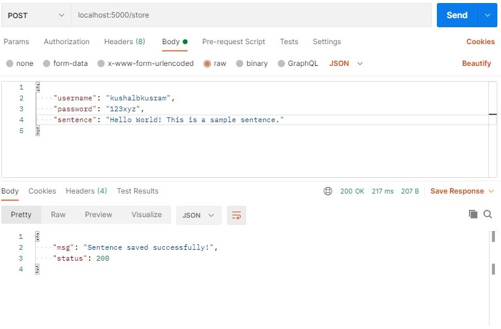

# DBaaS-REST-API

## Technical Description
 A RESTful implementation of DBaaS using Docker, Python, Flask and MongoDB.

## Concept
A database initialized using MongoDB with the objective to store username, encrypted password and sentences. Each user is allocated 6 tokens. The expense of each registration, sentence store and retrieval being 1 token.  

# Documentation

## Building:
1. Clone the repository. Make sure you have Docker installed on your machine. 
2. Run the following command within the root directory to initialize containers and build the application and the server: `docker-compose build`
3. Run the following command within the same root directory to deploy the application and start the server: `docker-compose up` or `docker-compose up -d` to run in detached mode. 
4. The server should be up and running at `localhost:5000` if everything successfully compiles, builds and containerizes. 

## Getting Started with API:

You may use a tool such as [Postman](https://www.postman.com/downloads/) to test the API with the following REST calls. 

- To register a user: `localhost:5000/register` </br>
    <strong>JSON:</strong>
    ```json
    {
        "username": "kushalbkusram",
        "password": "123xyz"
    }
    ```
    <strong>Expected Outcome:</strong>
    

- To store a sentence: `localhost:5000/store` </br>
    <strong>JSON:</strong>
    ```json
    {
        "username": "kushalbkusram",
        "password": "123xyz",
        "sentence": "Hello World! This is a sample sentence."
    }
    ```
    <strong>Expected Outcome:</strong>
    

- To retrieve a sentence: `localhost:5000/get` </br>
    <strong>JSON:</strong>
    </br>
    ```json
    {
        "username": "kushalbkusram",
        "password": "123xyz"
    }
    ```
    <strong>Expected Outcome:</strong>
    

